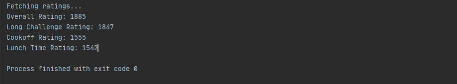
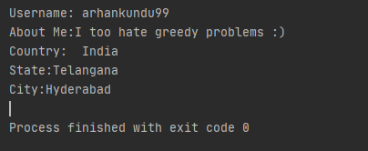
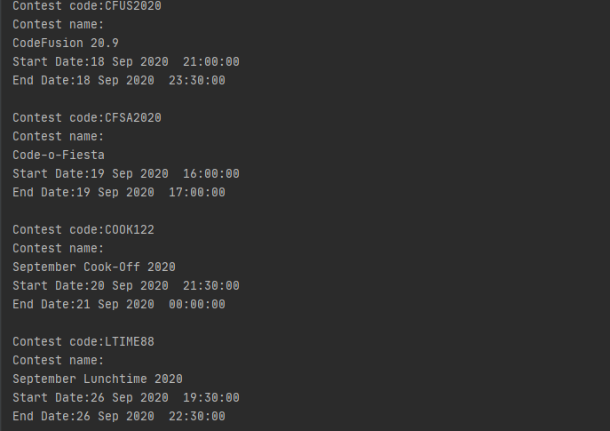

# README

These are the python scripts I use to fetch solutions, editorials and user profile on codechef

## Setup

You can clone this repository using `https://github.com/arhankundu99/codechef-crawler.git` \
Scripts are written in python3. So you should have a python3 interpreter

## Requirements

You can easily install all requirements by just using the following command- \
`$ pip install -r requirements.txt`

## Usage
### Get user specific details
```python
from user import User

# create an object of User class
User user = User('arhankundu99')
```

```python
user.download_all_codes(contest_name)
# Download codes of the user contest-wise in the SOLUTIONS folder
```


```python
user.get_ratings()
# returns the ratings of long challenges, lunchtimes and cook-off challenges of the user
```


```python
user.get_profile()
# returns user related profile
```


```python
user.has_solved(problem_code)
# returns true if the user has solved the problem
```


### Get editorials and schedule of future contests
```python
import crawler
crawler.get_schedule()
# returns future contests
```


```python
crawler.get_editorials(contest_name)
# Downloads the editorials for all the problems related to the contest in the EDITORIALS folder
```
